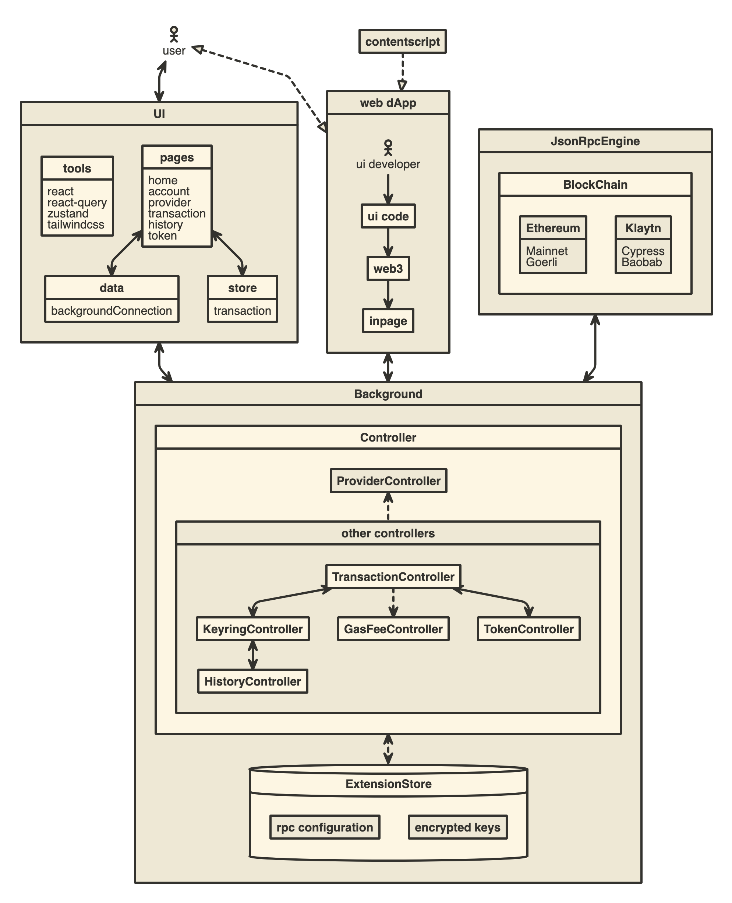

## Architecture

[][1]

[1]: https://www.nomnoml.com/#view/%5B%3Cactor%3Euser%5D%0A%0A%5BUI%7C%0A%09%5Btools%7C%0A%20%20%20%20%20%20react%0A%20%20%20%20%20%20react-query%0A%20%20%20%20%20%20zustand%0A%20%20%20%20%20%20tailwindcss%0A%20%20%20%20%5D%0A%20%20%20%20%5Bpages%7C%0A%20%20%09%20%20home%0A%20%20%20%20%20%20account%0A%20%20%20%20%20%20provider%0A%20%20%20%20%20%20transaction%0A%20%20%20%20%20%20history%0A%20%20%20%20%20%20token%0A%20%20%20%20%5D%0A%20%20%20%20%5Bdata%7C%0A%20%20%20%20%20%20backgroundConnection%0A%20%20%20%20%5D%0A%20%20%20%20%5Bstore%7C%0A%20%20%20%20%20%20transaction%0A%20%20%20%20%5D%0A%20%20%20%20%5Bpages%5D%3C-%3E%5Bdata%5D%0A%20%20%20%20%5Bpages%5D%3C-%3E%5Bstore%5D%0A%5D%0A%0A%5Bweb%20dApp%7C%0A%09%5B%3Cactor%3Eui%20developer%5D%0A%20%20%20%20%5Bui%20code%5D%0A%20%20%20%20%5Bweb3%5D%0A%20%20%20%20%5Binpage%5D%0A%20%20%20%20%5Bui%20developer%5D-%3E%5Bui%20code%5D%0A%20%20%20%20%5Bui%20code%5D-%3E%5Bweb3%5D%0A%20%20%20%20%5Bweb3%5D-%3E%5Binpage%5D%0A%5D%0A%0A%5Bcontentscript%5D%0A%0A%5BBackground%7C%0A%09%5BController%7C%0A%20%20%20%20%20%20%5BProviderController%5D%0A%20%20%20%20%20%20%5Bother%20controllers%7C%0A%20%20%20%20%20%20%09%5BKeyringController%5D%0A%20%20%20%20%20%20%20%20%5BTransactionController%5D%0A%20%20%20%20%20%20%20%20%5BGasFeeController%5D%0A%20%20%20%20%20%20%20%20%5BTokenController%5D%0A%20%20%20%20%20%20%20%20%5BHistoryController%5D%0A%20%20%20%20%20%20%20%20%5BTransactionController%5D%3C-%3E%5BTokenController%5D%0A%20%20%20%20%20%20%20%20%5BTransactionController%5D--%3E%5BGasFeeController%5D%0A%20%20%20%20%20%20%20%20%5BTransactionController%5D%3C-%3E%5BKeyringController%5D%0A%20%20%20%20%20%20%20%20%5BKeyringController%5D%3C-%3E%5BHistoryController%5D%0A%20%20%20%20%20%20%5D%0A%20%20%20%20%20%20%5BProviderController%5D%3C--%5Bother%20controllers%5D%0A%20%20%20%20%5D%0A%20%20%20%20%0A%20%20%20%20%5B%3Cdatabase%3EExtensionStore%7C%0A%20%20%09%09%5Brpc%20configuration%5D%0A%20%20%20%20%20%20%20%20%5Bencrypted%20keys%5D%0A%20%20%20%20%5D%0A%20%20%20%20%5BController%5D%3C--%3E%5BExtensionStore%5D%0A%5D%0A%0A%5BJsonRpcEngine%7C%0A%09%5BBlockChain%7C%0A%20%20%20%20%20%20%5BEthereum%7C%0A%20%20%20%20%20%20%20%20Mainnet%0A%20%20%20%20%20%20%20%20Goerli%0A%20%20%20%20%20%20%5D%0A%20%20%20%20%20%20%5BKlaytn%7C%0A%20%20%20%20%20%20%20%20Cypress%0A%20%20%20%20%20%20%20%20Baobab%0A%20%20%20%20%20%20%5D%0A%20%20%20%20%5D%0A%5D%0A%0A%5Buser%5D%3C-%3E%5BUI%5D%0A%5Buser%5D%3C%3A--%3A%3E%5Bweb%20dApp%5D%0A%5Bcontentscript%5D--%3A%3E%5Bweb%20dApp%5D%0A%5Bweb%20dApp%5D%3C-%3E%5BBackground%5D%0A%5BUI%5D%3C-%3E%5BBackground%5D%0A%5BJsonRpcEngine%5D%3C-%3E%5BBackground%5D%0A%0A%0A%0A%0A%0A%0A%0A%0A%0A%0A%0A%0A%0A%0A%0A%0A

## Reference: https://github.com/MetaMask/metamask-extension
